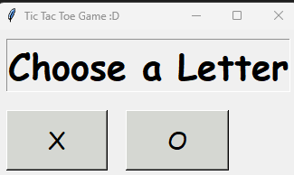

# Overview
There are two main windows: start and the game itself. 
you start by choosing X or O in the start window and the starting player is randomly chosen. 
the game has 3 natural outcomes: you either win , lose or it's a tie 
The opponent is a simple AI using minimax algorithm , with alpha beta pruning to reduce time. 
Gui is simple and made with tkinter library.
# Snippets:
## start window

## game time

## it's a tie!

